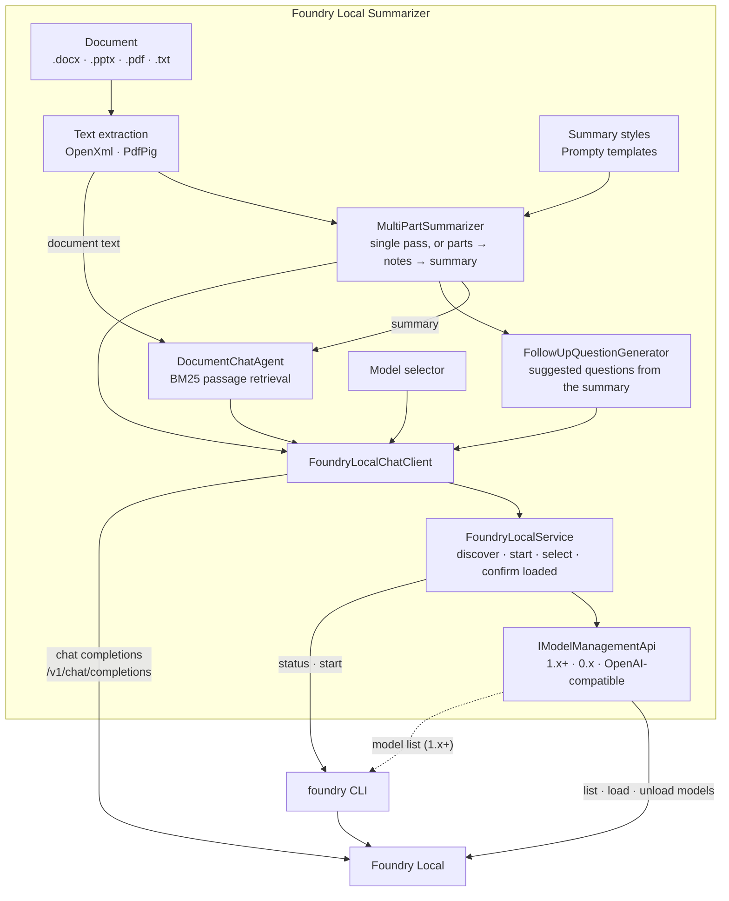

# Foundry Local Summarizer

[](https://github.com/sagarworlds/foundry-local-summarize/actions/workflows/ci.yml)
[](https://github.com/sagarworlds/foundry-local-summarize/releases/latest)
[](https://dotnet.microsoft.com/)
[](https://learn.microsoft.com/dotnet/desktop/wpf/)
[](LICENSE)

A Windows desktop application that summarizes documents and answers follow-up questions using a language model running
locally through [Microsoft Foundry Local](https://github.com/microsoft/Foundry-Local). Documents are processed entirely on
the user's machine; no content is sent to a cloud service.

## Table of contents

- [Features](#features)
- [Requirements](#requirements)
- [Installation](#installation)
- [Usage](#usage)
- [Model management](#model-management)
- [Configuration](#configuration)
- [Architecture](#architecture)
- [Troubleshooting](#troubleshooting)
- [Development](#development)
- [Releasing](#releasing)
- [Project structure](#project-structure)
- [License](#license)

## Features

- **Document summaries**: reads Word (`.docx`), PowerPoint (`.pptx`), PDF (`.pdf`) and text (`.txt`, `.md`) files.
- **Three summary styles**: Executive Bullets, Action-Item Extractor and Legal Compliance Check, defined as Prompty templates.
- **Long-document support**: documents that exceed the model's context window are read in parts and summarized from faithful per-part notes, so no content is silently truncated.
- **Grounded follow-up chat**: answers are drawn only from the document, cite the passages used (`[P1]`, `[P2]`, …), and state "The document does not say." when the answer is not present.
- **Document-specific suggested questions**: after each summary, the model proposes follow-up questions about the document's own people, figures, dates and clauses.
- **Model selection**: lists the models downloaded on the machine, loads and unloads them on demand, and remembers the choice.
- **Automatic service management**: locates Foundry Local (whose port changes on every start), starts it if needed, and reloads the model if Foundry Local unloads it.
- **Transparent failures**: every error states its cause and remedy; the application never displays generated placeholder text in place of a summary.
- **Reasoning-model support**: `<think>` reasoning emitted by models such as Qwen3 is removed from all output.

## Requirements

| Component | Version |
|---|---|
| Operating system | Windows 10 or Windows 11 (x64) |
| Runtime | [.NET 10 Desktop Runtime](https://dotnet.microsoft.com/download/dotnet/10.0) (x64) |
| Model host | [Foundry Local](https://github.com/microsoft/Foundry-Local) 0.x or 1.x and later |
| Model | Any Foundry Local chat model; `phi-4-mini` is recommended |

Any OpenAI-compatible local server (for example, Ollama) can be used in place of Foundry Local. See [Configuration](#configuration).

## Installation

1. Install Foundry Local and download a model:

   ```powershell
   winget install Microsoft.FoundryLocal
   foundry model download phi-4-mini
   ```

2. Install the [.NET 10 Desktop Runtime](https://dotnet.microsoft.com/download/dotnet/10.0) (x64). The installer does not include it.
3. Download `FoundrySummarizerSetup.exe` from the [latest release](https://github.com/sagarworlds/foundry-local-summarize/releases/latest) and run it.

Foundry Local does not need to be started manually; the application starts it and loads the model on launch.

## Usage

The main window contains two tabs, **Summarize** and **Chat**. The model selector and model status are shown in the
top-right corner.

### Summarizing a document

1. Select **Open Document…** and choose a file. The extracted text is displayed so it can be checked before summarizing.
2. Choose a **Style** and select **Summarize**. Progress is shown while long documents are read in parts; **Cancel** stops the operation.
3. Select **Copy** to place the summary on the clipboard.

| Style | Content |
|---|---|
| Executive Bullets | Objective and impact, cost figures, milestones, risks and decisions required |
| Action-Item Extractor | Task table with owners, deadlines and deliverables; decisions and blockers |
| Legal Compliance Check | Parties and terms; liability, indemnity and data clauses; termination terms; red flags |

All styles instruct the model to use only facts stated in the document, to reproduce figures, dates and names exactly,
and to write "Not stated in the document." rather than infer missing information.

> Scanned PDFs contain no text layer and must be processed with OCR before they can be summarized.

### Asking follow-up questions

On the **Chat** tab, type a question and press **Enter**, or select one of the suggested questions generated for the
current document. **Cancel** stops an answer in progress. **Clear Conversation** starts a new conversation while keeping
the document and summary loaded.

### Model status

| Indicator | Meaning |
|---|---|
| Green | A model is loaded and the application is ready. |
| Yellow, with a loading screen | A model is being loaded. The first load can take a minute. |
| Red, with a banner | No model is loaded. The banner states the reason and offers **Try Again**. |

Opening documents, summarizing and chat are available only while a model is loaded.

## Model management

### Selecting a model

The **Model** list shows the chat models downloaded on the machine; models already in memory are marked
"● in memory". Selecting a model unloads the current model and loads the new one. The model cannot be changed while a
summary or answer is in progress. The selection is stored in `%LOCALAPPDATA%\FoundrySummarizer\user-settings.json`.
Select **↻** to refresh the list after downloading a model.

When no model has been selected, the application chooses one automatically, in this order:

1. The highest-ranked entry of `Local.PreferredModels` that is already loaded.
2. The highest-ranked entry of `Local.PreferredModels` that is downloaded (it is loaded immediately).
3. `Local.ModelId`.

Models below roughly one billion parameters (for example `qwen2.5-0.5b` or `qwen3-0.6b`) respond quickly but often do
not follow the summary formats; `phi-4-mini` or larger is recommended.

### Keeping the model available

Foundry Local unloads models that have been idle for some time. The application verifies every 30 seconds that its model
is still loaded and reloads it when necessary. A model loaded outside the application (for example with
`foundry model run phi-4-mini`) is recognized. If Foundry Local stops responding on two consecutive checks, the
application reports it and recovers automatically when the service returns.

### Foundry Local versions

The application detects the Foundry Local version at runtime and supports both API generations:

| | Foundry Local 1.x and later | Foundry Local 0.x |
|---|---|---|
| Discovery and start | `foundry server status` / `foundry server start` | `foundry service status` / `foundry service start` |
| Model names | Aliases, e.g. `phi-4-mini` | Catalog IDs, e.g. `Phi-4-mini-instruct-generic-gpu:5` |
| Load / unload | `/models/load/{alias}`, `/models/unload/{alias}` | `/openai/load/{id}`, `/openai/unload/{id}` |
| Loaded models | `/models/loaded` | `/openai/loadedmodels` |
| Downloaded models | `foundry model list` | `/openai/models` |

## Configuration

Settings are read from `appsettings.json` in the installation folder (when running from source:
`src/FoundrySummarizer.Wpf/appsettings.json`).

| Setting | Default | Description |
|---|---|---|
| `Foundry:Local:AutoDiscover` | `true` | Locate Foundry Local using the `foundry` CLI. |
| `Foundry:Local:AutoStartService` | `true` | Start Foundry Local if it is not running. |
| `Foundry:Local:AutoSelectModel` | `true` | Choose the best available model until the user selects one. |
| `Foundry:Local:PreferredModels` | `phi-4-mini`, `qwen2.5-7b`, `phi-3.5-mini`, `qwen2.5-1.5b` | Preferred models, highest priority first. |
| `Foundry:Local:ModelId` | `qwen2.5-0.5b-instruct-generic-cpu` | Model used when no preferred model is available. |
| `Foundry:Local:Endpoint` | `http://127.0.0.1:63715/v1` | Endpoint used when discovery is disabled or finds no service. |
| `Foundry:Local:TimeoutSeconds` | `300` | Maximum time to wait for a model response. |
| `Foundry:Local:ModelLoadTimeoutSeconds` | `300` | Maximum time to wait for a model to load. |
| `Foundry:Summarization:MaxSinglePassTokens` | `2500` | Documents longer than this are read in parts. Increase for large-context models. |
| `Foundry:Chat:MaxPassageTokens` | `1500` | Amount of document text sent with each question. |
| `Foundry:Chat:MaxHistoryTurns` | `4` | Number of earlier question-and-answer pairs retained. |

**Using Ollama or another OpenAI-compatible server:** set `AutoDiscover` to `false`, `Endpoint` to the server address
(for Ollama, `http://localhost:11434/v1`) and `ModelId` to a model the server provides (for example `llama3.2:3b`).

## Architecture



Summaries, answers and suggested questions are sent by `FoundryLocalChatClient` directly to Foundry Local's
OpenAI-compatible endpoint. Before each request, `FoundryLocalService` makes sure the service is running and the selected
model is loaded; model listing, loading and unloading go through the `IModelManagementApi` implementation that matches
the detected Foundry Local version.

| Component | Responsibility |
|---|---|
| `DocumentIngestionPipeline` | Extracts plain text from supported file formats. |
| `MultiPartSummarizer` | Summarizes in a single request, or reads long documents in parts and summarizes the combined notes. |
| `PromptyEngine` | Provides the summary styles as Prompty templates. |
| `DocumentChatAgent` | Answers questions from the passages most relevant to each question, the summary and recent turns. |
| `FollowUpQuestionGenerator` | Produces document-specific suggested questions. |
| `FoundryLocalChatClient` | `IChatClient` used by the application; converts failures into actionable errors and removes model reasoning. |
| `FoundryLocalService` | Discovers and starts the service, selects the model and ensures it is loaded. |
| `IModelManagementApi` | Version-specific model management: `FoundryServerApi` (1.x+), `FoundryServiceApi` (0.x), `OpenAICompatibleApi`. |

The desktop application follows the MVVM pattern (CommunityToolkit.Mvvm) with dependency injection
(Microsoft.Extensions.DependencyInjection) and uses [Microsoft.Extensions.AI](https://learn.microsoft.com/dotnet/ai/microsoft-extensions-ai)
for model access. The view models live in a separate, WPF-free library (`FoundrySummarizer.Presentation`) and depend only
on interfaces, so the screen behaviour is unit-tested like the rest of the code.

## Troubleshooting

Error messages state the cause and the corrective action. The most common are listed below.

| Message | Resolution |
|---|---|
| `The 'foundry' command was not found` | Install Foundry Local (`winget install Microsoft.FoundryLocal`) and restart the application. |
| `No local model service is reachable at …` | Start Foundry Local (`foundry server start`; version 0.x: `foundry service start`), then select **↻**. |
| `Model '…' is not downloaded` | Run `foundry model download <model>`, then select **↻**. |
| `… has no model named '…'` | Select a different model from the list. |
| `accepted the request to load '…', but it is not among the loaded models` | The message lists the models Foundry Local reports as loaded. Run `foundry model run <model>` to view Foundry Local's error. |
| `did not report which models are loaded` | Restart Foundry Local, then select **↻**. |
| `did not answer within …s` | Increase `Foundry:Local:TimeoutSeconds`, or use a smaller or GPU-accelerated model. |
| `The text is too long for model '…'` | Reduce `Foundry:Summarization:MaxSinglePassTokens` or `Foundry:Chat:MaxPassageTokens`, or use a model with a larger context window. |
| `spent its whole answer on reasoning` | Select a model without built-in reasoning, such as `phi-4-mini`. |
| The application does not start | Install the .NET 10 Desktop Runtime (x64). |

## Development

### Prerequisites

- Windows 10 or 11
- [.NET 10 SDK](https://dotnet.microsoft.com/download/dotnet/10.0)
- Foundry Local (to run the application; not required for the tests)
- [Inno Setup 6](https://jrsoftware.org/isinfo.php) (only to build the installer locally)

### Build and run

```powershell
dotnet run --project src/FoundrySummarizer.Wpf/FoundrySummarizer.Wpf.csproj
```

Alternatively, open `FoundrySummarizer.slnx` in Visual Studio and press **F5**. Sample documents are provided in
[`samples/`](samples/).

### Test

```powershell
dotnet test FoundrySummarizer.slnx
```

There are two test projects:

- `tests/FoundrySummarizer.Tests` covers the core library and the view models. It runs on any OS and does not
  require Foundry Local or a model: the server, the `foundry` CLI and the model are replaced by in-process fakes,
  and the suite runs in a few seconds.
- `tests/FoundrySummarizer.Wpf.Tests` covers the WPF layer and runs on Windows only.

Together they cover:

| Area | Scenarios |
|---|---|
| Documents | Word (including tables), PowerPoint (including speaker notes), PDF and text extraction; corrupt, missing, empty and unsupported files; chunking of long lines and unbroken text |
| Summaries | Single-pass and multi-part summaries, summary styles, prompt rendering, removal of `<think>` reasoning |
| Chat | Passage retrieval and citations, conversation history, suggested questions, edge cases (no matching passage, blank question) |
| Foundry Local | Discovery and start (1.x+ and 0.x CLIs), version detection, model listing, loading, unloading and load confirmation, reload after idle unload, port changes, Ollama-style servers |
| Failures | Unreachable or stopped service, failed start, unknown or undownloaded models, load errors and timeouts, answers that time out, streaming errors, a hung `foundry` command, unreadable responses, request errors |
| Screens | Summarize tab, Chat tab (including cancelling a question), model selector (startup, switching, failed unload or save, remembered and configured models, loading state, recovery from outages and unexpected errors) and main-window wiring |
| Desktop app (Windows) | Every view loads with the app's styles and every binding resolves; startup settings and dependency-injection wiring; converters, the Open dialog filter and the clipboard |

Tests against a real Foundry Local are skipped by default. To run them, download a chat model
(for example `foundry model download phi-4-mini`) and then run:

```powershell
$env:FOUNDRY_LOCAL_TESTS = "1"
dotnet test tests/FoundrySummarizer.Tests --filter LocalFoundryIntegrationTests
```

Every push and pull request is built and tested by the [CI workflow](.github/workflows/ci.yml).

### Build the installer

```powershell
.\build_installer.ps1
```

The installer is written to `installer\Output\` and is not committed to source control.

## Releasing

1. Update the version in `installer/setup.iss` (`MyAppVersion`) and `src/FoundrySummarizer.Wpf/FoundrySummarizer.Wpf.csproj` (`<Version>`), and merge the change into `main`.
2. Create a GitHub release with a new tag `vX.Y.Z` on `main`, or push the tag:

   ```powershell
   git tag vX.Y.Z origin/main
   git push origin vX.Y.Z
   ```

3. The [release workflow](.github/workflows/release.yml) runs the tests, publishes the application, builds the installer with Inno Setup and attaches `FoundrySummarizerSetup.exe` to the release.

## Project structure

```
├── src/
│   ├── FoundrySummarizer.Core/          Class library (.NET 10)
│   │   ├── Ingestion/                   Text extraction and chunking
│   │   ├── Personas/                    Summary styles (Prompty)
│   │   ├── Summarization/               Single-pass and multi-part summarization
│   │   ├── Chat/                        Chat agent, passage retrieval, suggested questions
│   │   └── Routing/                     Model client, service discovery, model management
│   ├── FoundrySummarizer.Presentation/  View models and UI service interfaces (no WPF dependency)
│   │   ├── ViewModels/                  Summarizer, chat, model selector and main window
│   │   └── Services/                    User settings, model readiness, activity tracking, picker/clipboard interfaces
│   └── FoundrySummarizer.Wpf/           WPF desktop application
│       ├── Views/                       Summarize and Chat tabs
│       └── Services/                    Windows file picker and clipboard
├── tests/FoundrySummarizer.Tests/       xUnit tests for the core library and view models (any OS)
├── tests/FoundrySummarizer.Wpf.Tests/   xUnit tests for the WPF views and startup wiring (Windows)
├── samples/                             Sample documents
├── installer/setup.iss                  Inno Setup script
├── build_installer.ps1                  Local installer build script
└── .github/workflows/                   CI (build and test) and release workflows
```

## License

Released under the [MIT License](LICENSE).
