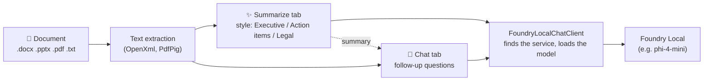

<div align="center">

# ⚡ Foundry Local Summarizer
### A Windows desktop app that summarizes documents with a model running on your own PC

[](https://dotnet.microsoft.com/)
[](https://learn.microsoft.com/dotnet/desktop/wpf/)
[](LICENSE)

</div>

Open a Word, PowerPoint, PDF or text file, pick a summary style, and get a summary from a small language model served by
**Microsoft Foundry Local**. Then ask follow-up questions about the document in the Chat tab. Nothing leaves your computer.

---

## How it works



1. **Open Document**: text is extracted from the file (a scanned PDF has no text and needs OCR first).
2. **Summarize**: the text is sent to the local model with the chosen style's prompt.
   - Short documents go in one request.
   - Documents over `Summarization.MaxSinglePassTokens` are read in parts. The model takes faithful notes on each part, then writes the summary from the notes, so nothing is cut off by a small model's context window.
3. **Chat**: each question is answered from the document passages most relevant to it (BM25 retrieval), plus the summary and the last few turns. Answers cite passages as `[P#]`, and the model is told to reply "The document does not say." rather than guess.

### Summary styles

| Style | What you get |
|---|---|
| **Executive Bullets** | Objective and impact, cost figures, milestones, risks and decisions needed |
| **Action-Item Extractor** | A task table with owners, deadlines and deliverables, plus decisions and blockers |
| **Legal Compliance Check** | Parties and terms, liability/indemnity/data clauses, termination terms, red flags |

Every style tells the model to use only facts from the document, copy figures, dates and names exactly, and write "Not stated in the document." instead of inventing. The styles live in `src/FoundrySummarizer.Core/Personas/PromptyEngine.cs` as Prompty templates.

### Finding Foundry Local

Foundry Local starts on a new port every time, so the app runs `foundry service status` to find it (as the official SDK does). If the service is stopped, it runs `foundry service start`. It then picks a model and loads it before the first request.

### Choosing the model

The **Model** list in the top-right corner shows every chat model downloaded on your PC, with loaded models marked "● in memory". Pick one (for example `Phi-4-mini-instruct-generic-gpu:5`) and the app unloads the current model, then loads the new one. While a model loads, a "Loading…" overlay covers the app; summarizing and chat stay disabled until a model is loaded, and a red banner explains why if loading fails. The model cannot be switched while a summary or answer is running. Your choice is remembered in `%LOCALAPPDATA%\FoundrySummarizer\user-settings.json`. Click **↻** after downloading a new model.

Until you pick one, the app chooses automatically:
1. The best `Local.PreferredModels` entry that is loaded (default order: `phi-4-mini`, `qwen2.5-7b`, `phi-3.5-mini`, `qwen2.5-1.5b`).
2. Otherwise the best preferred model that is downloaded. It is loaded on first use.
3. Otherwise `Local.ModelId`.

A tiny model that happens to be loaded never beats a preferred model on disk.

If no model can answer, the app shows the reason. It never shows made-up text in place of a summary.

---

## Getting started

**Prerequisites:** Windows 10/11, the [.NET 10 SDK](https://dotnet.microsoft.com/download/dotnet/10.0), and Foundry Local:

```powershell
winget install Microsoft.FoundryLocal
foundry model run phi-4-mini      # downloads and loads a good summarization model
```

**Run the app:**

```powershell
dotnet run --project src/FoundrySummarizer.Wpf/FoundrySummarizer.Wpf.csproj
```

Or open `FoundrySummarizer.slnx` in Visual Studio and press **F5**. Try it with the files in [`samples/`](samples/).

### Settings (`appsettings.json`)

| Setting | Default | Purpose |
|---|---|---|
| `Foundry:Local:AutoDiscover` | `true` | Find Foundry Local with the `foundry` CLI |
| `Foundry:Local:AutoStartService` | `true` | Start the service if it is stopped |
| `Foundry:Local:PreferredModels` | `phi-4-mini`, … | Models to prefer, best first |
| `Foundry:Local:ModelId` | `qwen2.5-0.5b-instruct-generic-cpu` | Used when no preferred model is available |
| `Foundry:Local:Endpoint` | `http://127.0.0.1:63715/v1` | Used only when discovery finds nothing |
| `Foundry:Local:TimeoutSeconds` | `300` | Maximum wait for one model answer |
| `Foundry:Summarization:MaxSinglePassTokens` | `2500` | Longer documents are read in parts; raise it for large-context models |
| `Foundry:Chat:MaxPassageTokens` | `1500` | Document text sent with each question |

To use **Ollama** instead, set `AutoDiscover` to `false`, `Endpoint` to `http://localhost:11434/v1` and `ModelId` to e.g. `llama3.2:3b`.

---

## Troubleshooting

When a summary or answer fails, the message says why:

| Message says… | Fix |
|---|---|
| `The 'foundry' command was not found` | Install Foundry Local: `winget install Microsoft.FoundryLocal`, then restart the app. |
| `No local model service is reachable at …` | Start it: `foundry service start`. |
| `could not load model '…'` | Download a model: `foundry model download phi-4-mini`, or run it once: `foundry model run phi-4-mini`. |
| `did not answer within …s` | Raise `Foundry:Local:TimeoutSeconds`, or use a smaller or GPU model. |

---

## Tests

```powershell
dotnet test tests/FoundrySummarizer.Tests/FoundrySummarizer.Tests.csproj
```

The tests cover text extraction, long-document summarizing, chat retrieval, prompts, model selection and Foundry Local discovery. None needs a running model: model calls use scripted fakes.

---

## Repository structure

```
├── src/
│   ├── FoundrySummarizer.Core/        # .NET 10 library
│   │   ├── Ingestion/                 # .docx / .pptx / .pdf / .txt text extraction, chunker
│   │   ├── Personas/                  # Prompty summary styles
│   │   ├── Summarization/             # MultiPartSummarizer (single pass or parts → notes → summary)
│   │   ├── Chat/                      # DocumentChatAgent + BM25 passage retriever
│   │   └── Routing/                   # FoundryLocalChatClient, discovery, model selection
│   └── FoundrySummarizer.Wpf/         # WPF app (MVVM, CommunityToolkit.Mvvm)
├── samples/                           # Example documents
└── tests/FoundrySummarizer.Tests/     # xUnit tests
```

## License
MIT. See [LICENSE](LICENSE).
