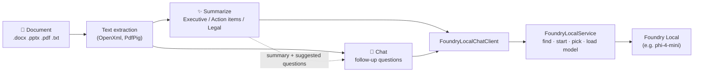

<div align="center">

# ⚡ Foundry Local Summarizer
### A Windows desktop app that summarizes documents with a model running on your own PC

[](https://github.com/sagarworlds/foundry-local-summarize/releases/latest)
[](https://dotnet.microsoft.com/)
[](https://learn.microsoft.com/dotnet/desktop/wpf/)
[](LICENSE)

</div>

Open a Word, PowerPoint, PDF or text file, pick a summary style, and get a summary from a small language model served by
**Microsoft Foundry Local**. Then ask follow-up questions about the document in the Chat tab. Nothing leaves your computer.

---

## Contents
- [Install](#install)
- [Using the app](#using-the-app)
- [How it works](#how-it-works)
- [Models](#models)
- [Settings](#settings-appsettingsjson)
- [Troubleshooting](#troubleshooting)
- [Building from source](#building-from-source)
- [Making a release](#making-a-release)
- [Repository structure](#repository-structure)

---

## Install

1. **Install Foundry Local** and download a summarization model (phi-4-mini gives good results on most PCs):
   ```powershell
   winget install Microsoft.FoundryLocal
   foundry model download phi-4-mini
   ```
2. **Install the [.NET 10 Desktop Runtime](https://dotnet.microsoft.com/download/dotnet/10.0)** (x64). The app needs it and the installer does not include it.
3. **Download and run the installer** from the [latest release](https://github.com/sagarworlds/foundry-local-summarize/releases/latest): `FoundrySummarizerSetup.exe`.

The app finds Foundry Local by itself, starts it if it is not running, and loads the model. You do not need to start anything first.

**Upgrading from v1:** run the v2 installer over it. v2 is a simpler, local-only app; see [what changed in v2](#what-changed-in-v2).

---

## Using the app

The window has two tabs, and the Foundry Local status and **Model** list sit in the top-right corner.

### ✨ Summarize
1. Click **📂 Open Document…** and choose a `.docx`, `.pptx`, `.pdf`, `.txt` or `.md` file. The extracted text appears on the left, so you can check what the model will read. A scanned PDF has no text layer and needs OCR first.
2. Pick a **Style** and click **✨ Summarize**. Long documents show "Reading part 2 of 5…" while they are read in parts. **✖ Cancel** stops a summary.
3. **📋 Copy** puts the summary on the clipboard.

| Style | What you get |
|---|---|
| **Executive Bullets** | Objective and impact, cost figures, milestones, risks and decisions needed |
| **Action-Item Extractor** | A task table with owners, deadlines and deliverables, plus decisions and blockers |
| **Legal Compliance Check** | Parties and terms, liability/indemnity/data clauses, termination terms, red flags |

### 💬 Chat
Ask follow-up questions about the open document. Press **Enter** to send; **✖ Cancel** stops an answer.
- After each summary, the model writes **suggested questions about this document** (its people, amounts, dates, clauses). Click one to ask it.
- Answers come only from the document and cite the passages they used as `[P1]`, `[P2]`…. If the document does not contain the answer, the model says "The document does not say." instead of guessing.
- **🗑 Clear Conversation** starts over; the document and summary stay loaded.

### Model status
- **Green dot**: a model is loaded and the app is ready.
- **Yellow dot / "Loading…" screen**: a model is being loaded. The first load can take a minute.
- **Red dot / red banner**: no model is loaded. The banner says why; click **↻ Try Again** after fixing it.

Everything waits until a model is loaded: opening documents, summarizing and chat are disabled until then.

---

## How it works



- **Summaries.** Short documents are sent to the model in one request. Documents longer than `Summarization.MaxSinglePassTokens` are read in parts: the model takes faithful notes on each part, then writes the summary from the notes, so nothing is cut off by a small model's context window. Every style tells the model to use only facts from the document, copy figures, dates and names exactly, and write "Not stated in the document." instead of inventing. The styles are Prompty templates in `src/FoundrySummarizer.Core/Personas/PromptyEngine.cs`.
- **Chat.** Each question is sent with only the document passages most relevant to it (BM25 retrieval), the summary and the last few turns, which keeps it within a small model's context window.
- **Reasoning models.** Models such as Qwen3 write their thinking in `<think>…</think>` before answering. The app removes it from summaries and answers, and asks Qwen3 not to think (`/no_think`) so its whole output goes to the answer.
- **Honest failures.** If no model can answer, the app shows the reason. It never shows made-up text in place of a summary.

---

## Models

### Choosing a model
The **Model** list shows the chat models downloaded on your PC; models already in memory are marked "● in memory". Picking one unloads the current model and loads the new one. The model cannot be switched while a summary or answer is running. Your choice is remembered in `%LOCALAPPDATA%\FoundrySummarizer\user-settings.json`. Click **↻** after downloading a new model.

Until you pick one, the app chooses automatically:
1. The best `Local.PreferredModels` entry that is loaded (default order: `phi-4-mini`, `qwen2.5-7b`, `phi-3.5-mini`, `qwen2.5-1.5b`).
2. Otherwise the best preferred model that is downloaded; it is loaded straight away.
3. Otherwise `Local.ModelId`.

A tiny model that happens to be loaded never beats a preferred model on disk. Very small models (0.5–0.6B, such as `qwen2.5-0.5b` or `qwen3-0.6b`) are fast but often ignore the summary format; use `phi-4-mini` or larger for good summaries.

### Staying loaded
Foundry Local unloads a model after it has been idle for a while. Every 30 seconds the app checks that its model is still loaded and loads it again if not (behind the "Loading…" screen). A model you load yourself, for example with `foundry model run phi-4-mini`, counts as loaded, and the app picks it up within 30 seconds. If Foundry Local stops answering twice in a row, the app shows the red banner with the reason, and recovers by itself when Foundry Local is back.

### Foundry Local versions
Foundry Local changed its CLI and web API between versions; the app detects which one is running and supports both:

| | Foundry Local 1.x and later | Foundry Local 0.x |
|---|---|---|
| Find / start | `foundry server status` / `foundry server start` | `foundry service status` / `foundry service start` |
| Model names shown | aliases, e.g. `phi-4-mini` | catalog ids, e.g. `Phi-4-mini-instruct-generic-gpu:5` |
| Load / unload | `/models/load/{alias}`, `/models/unload/{alias}` | `/openai/load/{id}`, `/openai/unload/{id}` |
| Loaded models | `/models/loaded` | `/openai/loadedmodels` |
| Downloaded models | `foundry model list` (Cached column) | `/openai/models` |

Foundry Local starts on a new port each time, so the app always asks the CLI where it is rather than using a fixed address. Other OpenAI-compatible servers such as **Ollama** work too; see [Settings](#settings-appsettingsjson).

---

## Settings (`appsettings.json`)

`appsettings.json` sits next to `FoundrySummarizer.Wpf.exe` in the install folder. When running from source, edit `src/FoundrySummarizer.Wpf/appsettings.json`.

| Setting | Default | Purpose |
|---|---|---|
| `Foundry:Local:AutoDiscover` | `true` | Find Foundry Local with the `foundry` CLI |
| `Foundry:Local:AutoStartService` | `true` | Start Foundry Local if it is stopped |
| `Foundry:Local:AutoSelectModel` | `true` | Choose the best available model until you pick one |
| `Foundry:Local:PreferredModels` | `phi-4-mini`, … | Models to prefer, best first |
| `Foundry:Local:ModelId` | `qwen2.5-0.5b-instruct-generic-cpu` | Used when no preferred model is available |
| `Foundry:Local:Endpoint` | `http://127.0.0.1:63715/v1` | Used only when discovery finds nothing (or with `AutoDiscover` off) |
| `Foundry:Local:TimeoutSeconds` | `300` | Maximum wait for one model answer |
| `Foundry:Local:ModelLoadTimeoutSeconds` | `300` | Maximum wait for a model to load |
| `Foundry:Summarization:MaxSinglePassTokens` | `2500` | Longer documents are read in parts; raise it for large-context models |
| `Foundry:Chat:MaxPassageTokens` | `1500` | Document text sent with each question |
| `Foundry:Chat:MaxHistoryTurns` | `4` | Earlier questions and answers kept for follow-ups |

To use **Ollama** instead, set `AutoDiscover` to `false`, `Endpoint` to `http://localhost:11434/v1` and `ModelId` to e.g. `llama3.2:3b`.

---

## Troubleshooting

Every failure says why. The most common messages:

| Message says… | Fix |
|---|---|
| `The 'foundry' command was not found` | Install Foundry Local: `winget install Microsoft.FoundryLocal`, then restart the app. |
| `No local model service is reachable at …` | Start it: `foundry server start` (0.x: `foundry service start`), then click **↻**. |
| `Model '…' is not downloaded` | `foundry model download <model>`, then click **↻**. |
| `… has no model named '…'` / `catalog has no model named '…'` | The name is wrong or the model was removed; pick another model from the list. |
| `accepted the request to load '…', but it is not among the loaded models` | The message lists what Foundry Local reports as loaded. Run `foundry model run <model>` in a terminal to see Foundry Local's own error. |
| `did not report which models are loaded` / `could not list its loaded models` | Restart Foundry Local (or restart the PC), then click **↻**. |
| `did not answer within …s` | Raise `Foundry:Local:TimeoutSeconds`, or use a smaller or GPU model. |
| `The text is too long for model '…'` | Lower `Foundry:Summarization:MaxSinglePassTokens` / `Foundry:Chat:MaxPassageTokens`, or choose a model with a larger context. |
| `spent its whole answer on reasoning` | The model only "thought" and never answered; choose a model without built-in reasoning, such as `phi-4-mini`. |
| The app does not start | Install the [.NET 10 Desktop Runtime](https://dotnet.microsoft.com/download/dotnet/10.0) (x64). |

---

## Building from source

**Prerequisites:** Windows 10/11, the [.NET 10 SDK](https://dotnet.microsoft.com/download/dotnet/10.0) and Foundry Local.

```powershell
# Run the app
dotnet run --project src/FoundrySummarizer.Wpf/FoundrySummarizer.Wpf.csproj

# Run the tests (no model needed: model calls use scripted fakes)
dotnet test tests/FoundrySummarizer.Tests/FoundrySummarizer.Tests.csproj
```

Or open `FoundrySummarizer.slnx` in Visual Studio and press **F5**. Try it with the files in [`samples/`](samples/).

The tests cover text extraction, long-document summarizing, chat retrieval and suggested questions, prompts, reasoning-output handling, model selection, and Foundry Local discovery, loading and version detection (0.x and 1.x+).

To build the installer locally, install [Inno Setup 6](https://jrsoftware.org/isinfo.php) and run `.\build_installer.ps1`; the installer is written to `installer\Output\` (not committed to git).

---

## Making a release

1. Set the new version in both `installer/setup.iss` (`MyAppVersion`) and `src/FoundrySummarizer.Wpf/FoundrySummarizer.Wpf.csproj` (`<Version>`), and merge to `main`.
2. Publish a release on GitHub with a new tag `vX.Y.Z` on `main` (or push the tag: `git tag vX.Y.Z origin/main && git push origin vX.Y.Z`).
3. The [release workflow](.github/workflows/release.yml) runs the tests, publishes the app, builds the installer with Inno Setup and attaches `FoundrySummarizerSetup.exe` to the release (about two minutes).

---

## What changed in v2

v2 is a focused rewrite around summarizing with Foundry Local:
- **Removed:** the Ingestion, Semantic Grounding (RAG), Agentic Workflows and Rigor & Evaluation tabs, the benchmark tool, cloud escalation and Privacy Mode, the simulated audio transcription, and the offline "demo output" (which showed canned text when no model answered).
- **Added:** long-document summaries read in parts; chat answers with `[P#]` citations and document-specific suggested questions; the Model list with load/unload; Foundry Local 1.x+ support; reliable loaded-model checks; hiding of `<think>` reasoning.

---

## Repository structure

```
├── src/
│   ├── FoundrySummarizer.Core/          # .NET 10 library
│   │   ├── Ingestion/                   # .docx / .pptx / .pdf / .txt text extraction, chunker
│   │   ├── Personas/                    # Prompty summary styles
│   │   ├── Summarization/               # MultiPartSummarizer (single pass, or parts → notes → summary)
│   │   ├── Chat/                        # DocumentChatAgent, BM25 passage retriever, suggested questions
│   │   └── Routing/                     # Talking to the local model server:
│   │       ├── FoundryLocalChatClient   #   IChatClient used by the app; clear errors, reasoning removal
│   │       ├── FoundryLocalService      #   find/start the server, pick and load the model
│   │       ├── IModelManagementApi      #   per-version model management:
│   │       │                            #     FoundryServerApi (1.x+), FoundryServiceApi (0.x), OpenAICompatibleApi
│   │       └── FoundryCli, FoundryModelTable, FoundryCatalog, LocalModelSelector, …
│   └── FoundrySummarizer.Wpf/           # WPF app (MVVM, CommunityToolkit.Mvvm)
│       ├── ViewModels/                  # Summarizer, Chat, ModelPicker, Main
│       ├── Views/                       # Summarize and Chat tabs
│       └── Services/                    # file picker, clipboard, user settings, model readiness, activity
├── tests/FoundrySummarizer.Tests/       # xUnit tests
├── samples/                             # Example documents
├── installer/setup.iss                  # Inno Setup script
├── build_installer.ps1                  # Local installer build
└── .github/workflows/release.yml        # Tag vX.Y.Z → tested, built installer on the GitHub release
```

## License
MIT. See [LICENSE](LICENSE).
