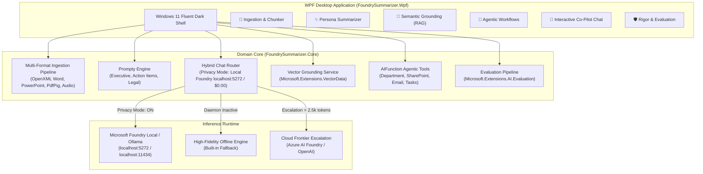

<div align="center">

# ⚡ Foundry Local Enterprise AI Summarizer
### Native WPF Desktop Application powered by C# and `Microsoft.Extensions.AI`

[](https://dotnet.microsoft.com/)
[](https://learn.microsoft.com/dotnet/desktop/wpf/)
[](tests/FoundrySummarizer.Tests)
[-22c55e)](#3-local-first--hybrid-architecture-foundry-local)
[-0078D4)](#3-local-first--hybrid-architecture-foundry-local)
[](LICENSE)

*An enterprise-ready document intelligence and summarization platform designed for zero cloud egress, offline small language models (SLMs), native document parsing, Prompty prompt personas, vector grounding, agentic tool workflows, and rigorous evaluation guardrails.*

</div>

---

## 📖 Table of Contents
- [Why Foundry Local Summarizer?](#-why-foundry-local-summarizer)
- [System Architecture](#-system-architecture)
- [The Six Extended Pillars](#-the-six-extended-pillars)
  - [1. Multi-Format Ingestion Pipeline](#1-multi-format-ingestion-pipeline)
  - [2. Advanced Summary "Personas" (Prompty)](#2-advanced-summary-personas-prompty)
  - [3. Local-First & Hybrid Architecture (Foundry Local)](#3-local-first--hybrid-architecture-foundry-local)
  - [4. Semantic Grounding (RAG with Microsoft.Extensions.VectorData)](#4-semantic-grounding-rag-with-microsoftextensionsvectordata)
  - [5. "Agentic" Summarization & Tool Calling](#5-agentic-summarization--tool-calling)
  - [6. Automated Rigor & Evaluation (Microsoft.Extensions.AI.Evaluation)](#6-automated-rigor--evaluation-microsoftextensionsaievaluation)
- [WPF Desktop User Experience](#-wpf-desktop-user-experience)
- [Getting Started](#-getting-started)
- [Running Automated Tests](#-running-automated-tests)
- [Sample Documents Included](#-sample-documents-included)
- [Repository Structure](#-repository-structure)
- [Documentation Links](#-documentation-links)
- [License](#-license)

---

## 💡 Why Foundry Local Summarizer?

Most document summarizers today are brittle web wrappers that upload sensitive corporate contracts, board minutes, and financial spreadsheets directly to public multi-tenant cloud APIs. 

**Foundry Local Enterprise AI Summarizer** changes this paradigm by combining:
1. **`Microsoft.Extensions.AI`**: The unified .NET abstraction layer providing vendor-neutral `IChatClient`, `IEmbeddingGenerator`, and middleware pipelines (`UseFunctionInvocation`, `UseLogging`).
2. **Microsoft Foundry Local**: Local offline execution using small language models (like **Phi-3.5**, **Phi-4**, and **Llama-3.2**) optimized for your local CPU, GPU, or NPU hardware.
3. **Zero Data Egress Guarantee**: When Privacy Mode is active, confidential documents never leave `localhost`.

---

## 🏛 System Architecture



---

## 🌟 The Six Extended Pillars

### 1. Multi-Format Ingestion Pipeline
Instead of accepting only raw pasted text, the ingestion subsystem extracts and structures data directly from binary enterprise document formats:
- **Microsoft Word (`.docx`)**: Body paragraphs, tables, and section hierarchies parsed via `DocumentFormat.OpenXml`.
- **Microsoft PowerPoint (`.pptx`)**: Slide-by-slide text, shapes, and speaker notes parsed via `DocumentFormat.OpenXml`.
- **Adobe PDF (`.pdf`)**: Page-by-page text extraction with coordinate boundary handling via `UglyToad.PdfPig`.
- **Meeting Audio & Recordings (`.mp3`, `.wav`)**: Meeting transcript and speaker parsing via `AudioTranscriptionService`.
- **Semantic Chunker**: Boundary-preserving sliding-window chunker with token size limits and context overlap.

### 2. Advanced Summary "Personas" (Prompty)
Prompts are decoupled from compiled application code using Microsoft's standard **Prompty** asset format (`.prompty` files with YAML frontmatter + markdown templates):
- **Executive Bullets**: Focuses strictly on high-level strategic value, explicit cost figures, quarterly ceilings, and C-suite decisions.
- **Action-Item Extractor**: Extracts an organized markdown matrix of tasks, assignees, deadlines, priorities (P1/P2/P3), and technical blockers.
- **Legal Compliance Check**: Reviews contracts against corporate legal standards (indemnification, liability cap limits, breach notice windows).
- **Interactive Prompty Editor**: Users can modify system and user prompt templates live inside the desktop UI.

### 3. Local-First & Hybrid Architecture (Foundry Local)
- **Privacy Mode Toggle**: Instant visual switch enforcing zero cloud egress. Processing runs entirely locally against Microsoft Foundry Local (dynamic port e.g. `http://127.0.0.1:63715/v1` or configured port) or Ollama (`http://localhost:11434/v1`) at **$0.00 inference cost**.
- **Dynamic Daemon Auto-Discovery**: Microsoft Foundry Local assigns a dynamic port by default (`port: auto`). The router automatically discovers active loopback endpoints directly from `~/.foundry/daemon.json` without requiring manual port updates when the daemon restarts.
- **Configurable via `appsettings.json`**: Both Local and Cloud endpoints are completely configurable without hard-coded values.
- **Hybrid Cost Escalation**: Standard documents route locally; documents exceeding the complexity threshold (> 2,500 tokens) can escalate to Cloud Frontier models when Privacy Mode is disabled.
- **Offline High-Fidelity Engine**: Self-contained fallback ensures turnkey demonstration and usage even if the background daemon is temporarily paused.

### 4. Semantic Grounding (RAG with `Microsoft.Extensions.VectorData`)
- Indexes verified corporate governance policies using `Microsoft.Extensions.VectorData` and a 384-dimensional cosine similarity embedder:
  - *Q2 Financial Framework*: $100,000 threshold requiring VP sign-off; $350k quarterly ceiling.
  - *Corporate Legal Contracting Standards*: Standard 1x to 2x contract liability caps.
  - *Data Sovereignty & Inference Directive*: Strict offline local inference requirements for confidential data.
- The AI automatically queries the vector store, identifies relevant policies, and cross-references document terms to flag discrepancies.

### 5. "Agentic" Summarization & Tool Calling
Uses `AIFunction` tools from `Microsoft.Extensions.AI`:
- `DetermineDepartment`: Automatically routes document to Finance, Legal, Engineering, or Executive.
- `SaveToSharePoint`: Archives the generated summary to the enterprise SharePoint repository.
- `EmailSummary`: Dispatches notification emails via enterprise SMTP to stakeholders.
- `CreateTask`: Creates tracking work items in Jira / Azure DevOps.
- **Interactive Co-Pilot Chat**: Multi-turn conversational memory thread allowing users to interrogate the generated summary (*"Why was risk #1 flagged?"*, *"Who is assigned to tasks?"*).

### 6. Automated Rigor & Evaluation (`Microsoft.Extensions.AI.Evaluation`)
Evaluates summaries against automated quality and safety guardrails:
- **Completeness Evaluator**: Measures key topic coverage from the source document.
- **Persona Adherence Evaluator**: Verifies structural compliance with persona rules.
- **Grounding Evaluator (Anti-Hallucination)**: Verifies all financial numbers and figures against source text.
- **Content Safety Guardrail**: Intercepts sensitive data leaks (SSNs, credit card patterns, confidential API tokens `sk-...`) with visual alert badges.

---

## 🖥 WPF Desktop User Experience

The application features a modern Windows 11 Fluent Dark Theme:

| Tab | Feature Description |
|---|---|
| **📄 Ingestion Pipeline** | Drag-and-drop file upload (`.docx`, `.pptx`, `.pdf`, `.txt`, `.mp3`), token/character counters, raw text preview, and semantic chunk breakdown list. |
| **✨ Persona Summarizer** | Select summary profile (*Executive Bullets*, *Action Items*, *Legal*), toggle RAG grounding, view routing decision card ($0.00 cost), and edit Prompty templates live. |
| **🧠 Semantic Grounding** | Inspect indexed policies in `Microsoft.Extensions.VectorData`, test live cosine similarity matching, and index new corporate policies. |
| **🤖 Agentic Workflows** | One-click trigger for Auto-Filing Agent with 4-step pipeline status cards and real-time function calling audit logs. |
| **💬 Interactive Chat** | Follow-up conversation window with starter chips (*"Why was budget flagged?"*, *"Who is assigned?"*) and multi-turn context memory. |
| **🛡️ Rigor & Evaluation** | Progress meters for Completeness, Adherence, Grounding, and a "Test Unsafe PII Guardrail" button to verify live interception. |

---

## 🚀 Getting Started

### Prerequisites
- **Operating System**: Windows 10 or Windows 11 (x64)
- **SDK**: [.NET 10.0 SDK](https://dotnet.microsoft.com/download/dotnet/10.0) or [.NET 9.0 SDK](https://dotnet.microsoft.com/download/dotnet/9.0) with Windows Desktop runtime

### Launching the Desktop Application
Clone the repository and run:

```powershell
# Run the WPF Desktop Application
dotnet run --project src/FoundrySummarizer.Wpf/FoundrySummarizer.Wpf.csproj
```

Or open `FoundrySummarizer.sln` in Visual Studio 2022 / 2026 and press **F5**.

---

## 🧪 Running Automated Tests

The solution includes 23 automated unit and integration tests covering all six architectural pillars:

```powershell
dotnet test
```

```
Test run for .../FoundrySummarizer.Tests.dll (.NETCoreApp,Version=v10.0)
A total of 1 test files matched the specified pattern.

Passed!  - Failed: 0, Passed: 23, Skipped: 0, Total: 23, Duration: 632 ms
```

---

## 📂 Sample Documents Included

Test documents are included in the `samples/` directory:
- [`sample_project_proposal.docx`](samples/sample_project_proposal.docx): Binary OpenXml Word document requesting $150,000 for local GPU acceleration hardware.
- [`sample_executive_deck.pptx`](samples/sample_executive_deck.pptx): Binary OpenXml PowerPoint deck with slides and notes.
- [`sample_meeting_transcript.txt`](samples/sample_meeting_transcript.txt): Project Helios review meeting transcript with participants and action items.
- [`sample_contract.txt`](samples/sample_contract.txt): Master Services Agreement containing a 3x liability cap policy exception.
- [`sample_financial_proposal.txt`](samples/sample_financial_proposal.txt): Capital allocation proposal.
- [`corporate_policies/`](samples/corporate_policies/): Corporate policy guidelines for financial governance and cloud compliance.

---

## 📁 Repository Structure

```
foundry-summerize-app/
├── FoundrySummarizer.sln                 # Visual Studio Solution
├── IMPLEMENTATION_PLAN.md               # Detailed Technical Architecture Plan
├── README.md                            # Main GitHub Documentation
├── WALKTHROUGH.md                       # Comprehensive Technical Walkthrough
├── .gitignore                           # Git ignore rules for .NET / WPF
│
├── src/
│   ├── FoundrySummarizer.Core/          # Core Domain Library (.NET 10.0)
│   │   ├── Ingestion/                   # Docx, Pptx, Pdf, Audio parsers & SemanticChunker
│   │   ├── Personas/                    # PromptyEngine, document model & .prompty files
│   │   ├── Routing/                     # HybridChatClientRouter & LocalFoundryFallbackClient
│   │   ├── Grounding/                   # VectorGroundingService & SemanticEmbeddingGenerator
│   │   ├── Agentic/                     # AutoFilingAgent, Tools & InteractiveSummaryChatAgent
│   │   └── Evaluation/                  # IEvaluator implementations & EvaluationPipeline
│   │
│   └── FoundrySummarizer.Wpf/           # Native WPF Desktop Application (.NET Windows Desktop)
│       ├── ViewModels/                  # MVVM ViewModels (CommunityToolkit.Mvvm)
│       ├── Views/                       # Modern XAML Views with real-time feedback
│       ├── Styles/                      # Windows 11 Fluent Dark Theme
│       └── Converters/                  # Value Converters for UI binding
│
├── samples/                             # Sample files (.docx, .pptx, .txt, policies)
└── tests/
    └── FoundrySummarizer.Tests/         # 23 Automated xUnit Tests
```

---

## 📚 Documentation Links
- [Implementation Plan (`IMPLEMENTATION_PLAN.md`)](IMPLEMENTATION_PLAN.md)
- [Technical Walkthrough (`WALKTHROUGH.md`)](WALKTHROUGH.md)
- [Microsoft.Extensions.AI Documentation](https://learn.microsoft.com/dotnet/api/microsoft.extensions.ai)
- [Prompty Documentation](https://prompty.ai/)
- [Microsoft Foundry Local](https://azure.microsoft.com/)

---

## 📄 License
This project is licensed under the MIT License - see the [LICENSE](LICENSE) file for details.
