# Enterprise AI Summarizer - WPF Desktop Application Walkthrough

The **Enterprise AI Summarizer** is a native WPF desktop application for Windows (.NET 10.0-windows / .NET 9.0) built on **`Microsoft.Extensions.AI`** and **Microsoft Foundry Local**. It provides an offline-first document intelligence platform across all six extended architectural pillars.

---

## 🏛️ Architecture Overview

```mermaid
graph TD
    subgraph UI ["WPF Desktop Application (FoundrySummarizer.Wpf)"]
        MainWindow["MainWindow (Windows 11 Fluent Dark Shell)"]
        TabControl["Native WPF TabControl (SelectedIndex Sync)"]
        Tab1["📄 Ingestion & Chunker"]
        Tab2["✨ Persona Summarizer"]
        Tab3["🧠 Semantic Grounding (RAG)"]
        Tab4["🤖 Agentic Workflows"]
        Tab5["💬 Interactive Co-Pilot Chat"]
        Tab6["🛡️ Rigor & Evaluation"]
        MainWindow --> TabControl
        TabControl --> Tab1
        TabControl --> Tab2
        TabControl --> Tab3
        TabControl --> Tab4
        TabControl --> Tab5
        TabControl --> Tab6
    end

    subgraph Core ["Core Subsystems (FoundrySummarizer.Core)"]
        Ingestion["Multi-Format Ingestion Pipeline<br/>(Docx, Pptx, Pdf, Audio, Chunker)"]
        Personas["Prompty Engine<br/>(Executive Bullets, Action Items, Legal)"]
        Router["Hybrid Chat Router<br/>(Privacy Mode: Local Foundry localhost:5272 / $0.00)"]
        Grounding["Vector Grounding Service<br/>(Microsoft.Extensions.VectorData)"]
        Agentic["Agentic Tool Calling<br/>(Auto-Filing: SharePoint, Email, Tasks)"]
        Evaluation["Evaluation Pipeline<br/>(Microsoft.Extensions.AI.Evaluation)"]
    end

    MainWindow --> Ingestion
    MainWindow --> Personas
    MainWindow --> Router
    MainWindow --> Grounding
    MainWindow --> Agentic
    MainWindow --> Evaluation
```



---

## 🚀 Key Features Implemented

### 1. Multi-Format Ingestion Pipeline
- **Native Document Parsers**:
  - Word Processing (`.docx`): Extracted via `DocumentFormat.OpenXml` in `src/FoundrySummarizer.Core/Ingestion/DocxDocumentParser.cs`.
  - Presentation Decks (`.pptx`): Extracted via `DocumentFormat.OpenXml` in `src/FoundrySummarizer.Core/Ingestion/PptxDocumentParser.cs`.
  - PDF Documents (`.pdf`): Extracted via `UglyToad.PdfPig` in `src/FoundrySummarizer.Core/Ingestion/PdfDocumentParser.cs`.
  - Plain Text & Transcripts (`.txt`, `.md`, `.json`): Extracted in `src/FoundrySummarizer.Core/Ingestion/PlainTextParser.cs`.
  - Audio & Meeting Recordings (`.mp3`, `.wav`): Transcribed in `src/FoundrySummarizer.Core/Ingestion/AudioTranscriptionService.cs`.
- **Semantic Chunker**:
  - Context-preserving chunker adhering to sentence and paragraph boundaries with configurable token limits and overlap in `src/FoundrySummarizer.Core/Ingestion/SemanticChunker.cs`.

### 2. Advanced Summary "Personas" (Prompty)
- Implemented Microsoft's Prompty format standard (YAML frontmatter + markdown template):
  - **Executive Bullets**: Focuses on operational impact, financial figures, strategic timelines, and C-suite decisions (`src/FoundrySummarizer.Core/Personas/Prompts/ExecutiveBullets.prompty`).
  - **Action-Item Extractor**: Markdown table of tasks, owners, deadlines, priority levels, and open blockers (`src/FoundrySummarizer.Core/Personas/Prompts/ActionItemExtractor.prompty`).
  - **Legal Compliance Check**: Contractual analysis of liability caps (1x/2x standards), indemnification terms, and breach consequences (`src/FoundrySummarizer.Core/Personas/Prompts/LegalComplianceCheck.prompty`).
- In-app Prompty editor allowing real-time modification of system and user prompt templates.

### 3. Local-First & Hybrid Foundry Local Router
- **Privacy Mode (100% Offline)**:
  - Strict toggle switch enforcing zero external cloud egress.
  - Connects to Microsoft Foundry Local (e.g. `http://127.0.0.1:63715/v1` or configured port) or local Ollama (`http://localhost:11434/v1`) running small language models (Qwen2.5, Phi-3.5, Phi-4, Llama-3.2) at **$0.00 cost** in `src/FoundrySummarizer.Core/Routing/HybridChatClientRouter.cs`.
- **Dynamic Daemon Auto-Discovery**:
  - Microsoft Foundry Local defaults to dynamic loopback allocation (`port: auto`). The router reads `~/.foundry/daemon.json` dynamically to resolve active ports automatically.
- **Configurable via `appsettings.json`**:
  - Fully externalized configuration with no hard-coded endpoints.
- **Smart Cost Escalation**:
  - Routes standard documents locally ($0.00) and escalates documents exceeding 2,500 tokens to Cloud Frontier models when Privacy Mode is disabled.
- **High-Fidelity Offline Engine**:
  - Built-in offline fallback engine guarantees turnkey demonstration and execution even if the local daemon hasn't been started yet in `src/FoundrySummarizer.Core/Routing/LocalFoundryFallbackClient.cs`.

### 4. Semantic Grounding (RAG with Microsoft.Extensions.VectorData)
- Implemented `IVectorGroundingService` with `Microsoft.Extensions.VectorData` (`src/FoundrySummarizer.Core/Grounding/VectorGroundingService.cs`) and 384-dimensional cosine similarity embedder (`src/FoundrySummarizer.Core/Grounding/SemanticEmbeddingGenerator.cs`).
- Pre-indexes internal corporate policies:
  - *Q2 Financial Framework*: Caps capital spend at $350k; mandates VP sign-off for expenditures exceeding $100k.
  - *Corporate Legal Contracting Standards*: Enforces maximum 1x to 2x contract liability caps.
  - *Data Sovereignty & Inference Directive*: Mandates local-first processing for confidential data.
- Automatically queries the vector database, identifies relevant policies, and injects citations into the summary prompt to flag deviations.

### 5. "Agentic" Summarization & Tool Calling
- Implemented `AIFunction` tools from `Microsoft.Extensions.AI` in `src/FoundrySummarizer.Core/Agentic/AutoFilingTools.cs`:
  - `DetermineDepartment`: Classifies summary into Finance, Legal, Engineering, or Executive.
  - `SaveToSharePoint`: Archives summary to enterprise SharePoint library.
  - `EmailSummary`: Dispatches email notification via enterprise SMTP to stakeholders.
  - `CreateTask`: Creates tracking work items in Jira/Azure DevOps.
- **Auto-Filing Agent** (`src/FoundrySummarizer.Core/Agentic/AutoFilingAgent.cs`): Executes tool chain and emits real-time execution logs.
- **Interactive Co-Pilot Chat** (`src/FoundrySummarizer.Core/Agentic/InteractiveSummaryChatAgent.cs`): Multi-turn conversational memory allowing users to interrogate the generated summary and original document.

### 6. Automated Rigor & Evaluation (Microsoft.Extensions.AI.Evaluation)
- Comprehensive evaluation pipeline implementing `IEvaluator` in `src/FoundrySummarizer.Core/Evaluation/EvaluationPipeline.cs`:
  - `CompletenessEvaluator`: Scores coverage of source entities and facts.
  - `PersonaAdherenceEvaluator`: Validates structural compliance with persona rules.
  - `GroundingEvaluator`: Anti-hallucination fact checker verifying numbers and figures.
  - `ContentSafetyGuardrailEvaluator`: Intercepts sensitive data leaks (SSNs, credit card numbers, confidential API keys `sk-...`) with visual warning badges.

---

## 🧪 Verification & Test Results

All 26 automated unit and integration tests execute and pass cleanly, including dynamic configuration binding and live Foundry Local daemon communication:

```powershell
dotnet test
```

```
Test run for .../FoundrySummarizer.Tests.dll (.NETCoreApp,Version=v10.0)
A total of 1 test files matched the specified pattern.

Passed!  - Failed:     0, Passed:    26, Skipped:     0, Total:    26, Duration: 6 s
```

| Test Class | Verifications Performed | Status |
|---|---|---|
| `ConfigurationTests` | AppSettings JSON binding, auto-discovery from `~/.foundry/daemon.json`, live daemon ping | **PASS** ✅ |
| `IngestionTests` | PlainText, SemanticChunker, Docx OpenXML, Pptx OpenXML, Audio Transcription, Pipeline | **PASS** ✅ |
| `PersonaTests` | PromptyEngine 3 built-in personas, variable interpolation, custom Prompty parsing | **PASS** ✅ |
| `HybridRouterTests` | Privacy Mode isolation ($0.00 cost), live local daemon response, fallback generation | **PASS** ✅ |
| `VectorGroundingTests` | 384-dim embedder normalization, policy retrieval, prompt grounding context | **PASS** ✅ |
| `AgenticToolsTests` | Department categorization, SharePoint archival, Email dispatch, Task creation, Chat | **PASS** ✅ |
| `EvaluationTests` | Completeness score, Grounding fact verification, PII/token guardrail interception | **PASS** ✅ |

---

---

## 🎨 UI Ergonomics & Desktop Responsiveness

1. **Screen WorkArea Auto-Fit & Title Bar Protection**:
   - Automatically inspects `SystemParameters.WorkArea` during window initialization.
   - Constrains height (`workArea.Height - 50`) and width (`workArea.Width - 40`) to prevent the window from exceeding screen boundaries on laptops with 125% or 150% Windows display scaling.
   - Ensures the top window header bar with the **Minimize, Maximize, and Close** buttons is always 100% visible and accessible.

2. **Full Dark-Theme ComboBox Controls**:
   - Replaced default OS theme ComboBox templates with a custom XAML control template.
   - Closed state displays crisp light text (`#f9fafb`) on dark slate (`#111827`) with a custom sky-blue chevron arrow.
   - Dropdown list popup has a dark surface background (`#111827`) with border `#374151`.
   - `ComboBoxItem` entries feature high-contrast light typography, slate hover highlight (`#1f2937`), and deep blue selection state (`#1e3a5f`).
   - Completely eliminates OS white-on-white text bugs in dark mode.

---

## 🖥️ Running the WPF Desktop Application

Launch the desktop app directly from PowerShell:

```powershell
dotnet run --project src/FoundrySummarizer.Wpf/FoundrySummarizer.Wpf.csproj
```

Or open the solution file `FoundrySummarizer.slnx` in Visual Studio and press **F5**.
